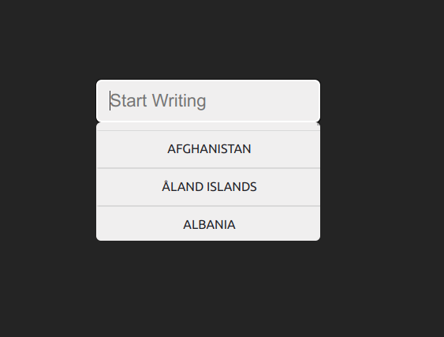

# AutoComplete React Component

## Overview
This `AutoComplete` React component enhances user input experience by providing real-time suggestions as the user types. It is minimalist, highly customizable and easy to integrate into your React projects.



## Features
- 🔄 **Dynamic Filtering**: Filters options based on user input.
- ✨ **Customizable Styles**: Supports BEM methodology for easy styling.
- 🔒 **Option Restriction**: Option to restrict input to the provided options.
- 🔄 **Updatable**: Responds to changes with an `onChange` handler.

## Installation
```bash
npm install autocomplete-react-minimalist
```

## Usage
```
import AutoComplete from "autcomplete-react-minimalist";

const options = [
  { label: "Afghanistan", key: "AF" },
  { label: "Åland Islands", key: "AX" },
  { label: "Albania", key: "AL" },
  { label: "Algeria", key: "DZ" },
  { label: "American Samoa", key: "AS" },
  { label: "Andorra", key: "AD" },
];

const MyComponent = () => {
  return (
    <AutoComplete
      inputKey="my-autocomplete"
      placeholder="Type to search..."
      listToFilter={options}
      modifierClass=""
      isRestrictedToOption={true}
      onChange={(value) => console.log(value)}
    />
  );
};
```

## Props
- 🆔 `inputKey` (string): Unique key for the input element.
- 💬 `placeholder` (string): Placeholder text for the input field.
- 📋 `listToFilter` (array): Array of objects with `key` and `label` to filter. Inside sample you can find a json example.
- 🎨 `modifierClass` (string): Custom CSS class for styling.
- 🚀 `initValue` (string): Initial value of the input.
- 🔒 `isRestrictedToOption` (boolean): Restricts input to the provided options.
- 🔄 `onChange` (function): Callback function for input change.


## Styles
Use BEM conventions for custom styling. We're working to support tailwind and Typescript.